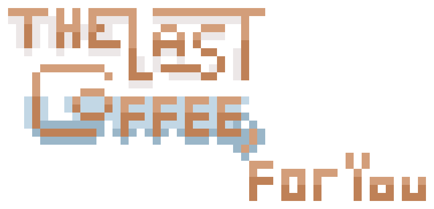

  

# ☕ The Last Coffee, For You  
*Will you share one last cup… or let the moment slip away forever?*  

You never know when a conversation will be your last.  
Will you say your goodbyes before it's too late?  
Will you reconnect before the distance becomes permanent?  
Or will you live with the quiet ache of knowing  
that your final moment together has already passed?  

This is a branching, open-ended experience about fleeting connections, unspoken words, and the warmth (and bitterness) of coffee shared in silence.  

# Why i made LCFY  

As a person, you have strayed away and had your last conversation with people you know, without even knowing.  
or maybe you'd like to believe you already had that last conversation with a certain someone?  

New Direction: As a person, i also see the power to make a new interaction from final interactions long passed,  
there's also people i thought i'd never be able to talk to again but had the power to, and weirdly, it was them again.  
the inspiration, the stranger who showed me the world. he, the foundation. and maybe that was the last, but i'd like to believe,  
we'd have one more, to share the cup of coffee he brewed for me...  

afterall, he was the one... who made me fall inlove with coffee...  

# What LCFY Aims to Tell  

Simple, I'm a yearner, i long for connections, but people are temporary... impactful but temporary  
and i want to revisit these types of people, i want to highlight these fleeting people in life that makes a difference  

because at that time, when you still know them, you really thought they will last.
And it's sometimes for the best that your roads have already went past the intersection.  

thanks for happening, i learnt a lot  
---

## 🎵 *The Coffee I Brewed for You*  
_(Snippet of the game's song, there's a full ver ngem...)_  

> One day, you'll get tired of the coffee,  
> Tired of the monotony of the same old story.  
> A latte with some toffee, a fresh cold brew coffee—  
> The same flavors you once called "mine,"  
> a cup of coffee some time?  
>   
> I'd like to think we'll collide one day,  
> We'll share a coffee along the way.  
> Oh, I'll make a cup of ol’ times for you,  
> The memories we'll share once we're through.  
> The same flavors you called "mine," a cup of coffee some time?  
> Will there be a next time…  
> or was this our last… time…  

---

### 🎮 Status
- Branching narrative framework ✅  
- Core theme brewing ☕  
- Emotional damage in progress 💔  

---

<i>Sometimes, the cup grows cold before you even take a sip.</i>
